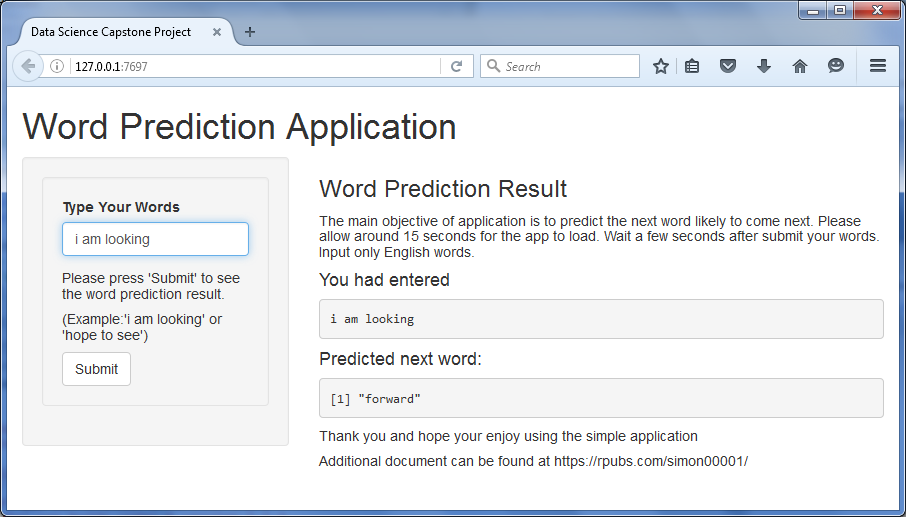

Data Science Capstone-Word Prediction Shiny App
========================================================
author: Simon Kong
date: 21 April 2016

The Objective
========================================================
The main goal of this capstone project is to build a shiny application that is able to predict the next word. This exercise was divided into several sub tasks like data cleansing, exploratory analysis, the creation of a predictive model, and application development.

The data is downloaded from the link given in coursera link: https://d396qusza40orc.cloudfront.net/dsscapstone/dataset/Coursera-SwiftKey.zip. Sample data are taken from the 3 files (news, blog and twitter) to create a frequency dictionary and thus to predict the next word.

All text mining and natural language processing was done with the usage of a variety of well-known R functions and packages (eg. TM, etc). 

Solution Approach, Methods & Models
========================================================
  
The solution is using n-gram backoff approach. The sample data extracted was cleaned by conversion to lowercase, removing punctuation, white space, numbers and all kinds of special characters before being extracted. 

> N-Gram Backoff Model. This modeling technique used, consists of counting the number of unigram, bigrams, and trigrams in the training data and using them to predict the next word. This process is called [*n*-grams](http://en.wikipedia.org/wiki/N-gram) [tokenization](http://en.wikipedia.org/wiki/Tokenization_%28lexical_analysis%29).

The result transferred into frequency dictionaries & used to predict the next word corresponding to the words input by a user. Some of the unwanted words below certain frequency threshold had been removed to reduce the size of the dictionaries and to improve the speed of processing.

The Application UI & Usage
========================================================
  
The user interface of this application was designed with small device in mind. While entering the text on the left hand side, the entered words will be displayed and the predicted next word refreshes instantaneously on the right hand.

Additional Information
========================================================
  
* This word prediction app is hosted on shinyapps.io: [https://simonk.shinyapps.io/capstone/](https://simonk.shinyapps.io/capstone/)

* The whole code of this application, as well as all the milestone report, related scripts, this presentation  etc. can be found in this GitHub repo: [https://github.com/simon00001](https://github.com/simon00001)

* Learn more about the Coursera Data Science Specialization: [https://www.coursera.org/specialization/jhudatascience/1](https://www.coursera.org/specialization/jhudatascience/1)

Enjoy using the application!
